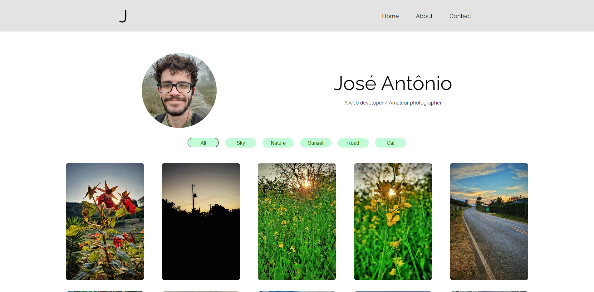
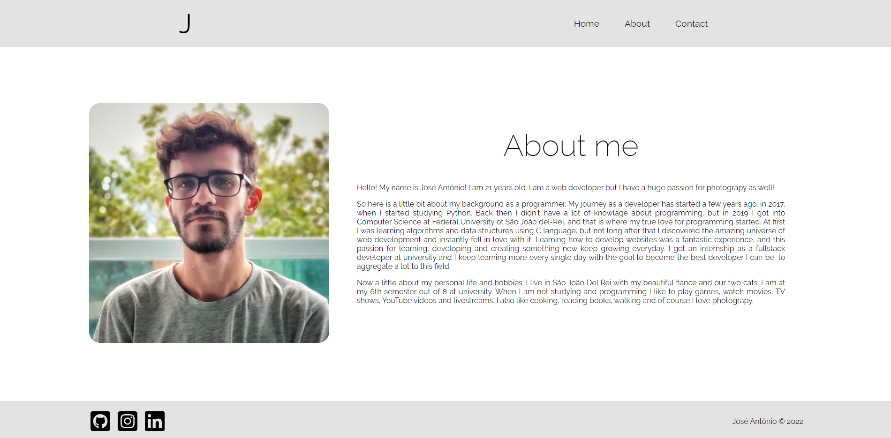
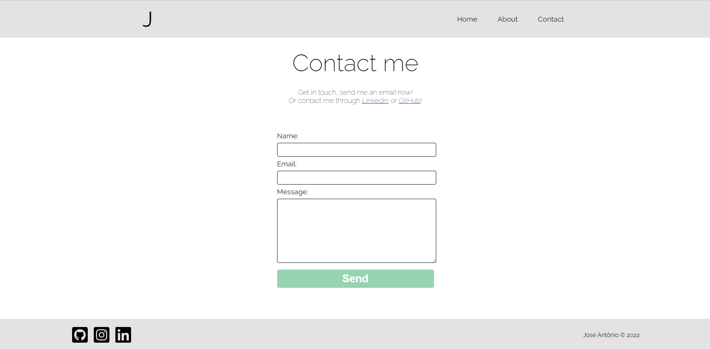

# Photography Gallery App 🖼️

### Check it out now! 💻
### [Live Site](https://effulgent-youtiao-85ae83.netlify.app/)

### About the project
🇧🇷
 
Este é um projeto pessoal que criei para estudar e aprender novos conceitos de React. É baseado no portfólio de um fotógrafo. O projeto tem alguns recursos interessantes, como o filtro de imagens, a página de informações e o formulário de contato funcional na página de contato.

🇺🇸
 
This is a personal project I created to study and learn new React concepts. It is based on a portfólio of a photographer. The project have some nice features, like the images filter, the about page and the functional contact form on the contact page.

## Built with 🛠️
- React.js
- EmailJS
- Framer Motion
- React Icons
- CSS3
- VSCode

## Available Scripts

In the project directory, you can run:

### `npm start`

Runs the app in the development mode.\
Open [http://localhost:3000](http://localhost:3000) to view it in your browser.

The page will reload when you make changes.\
You may also see any lint errors in the console.

##  Screenshots

#### Author
José Antônio ©️ 2022
